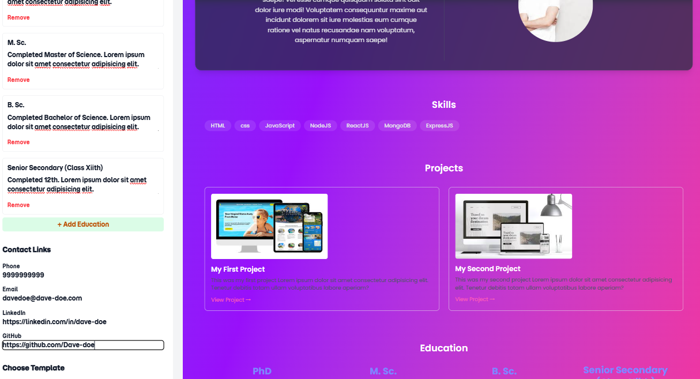
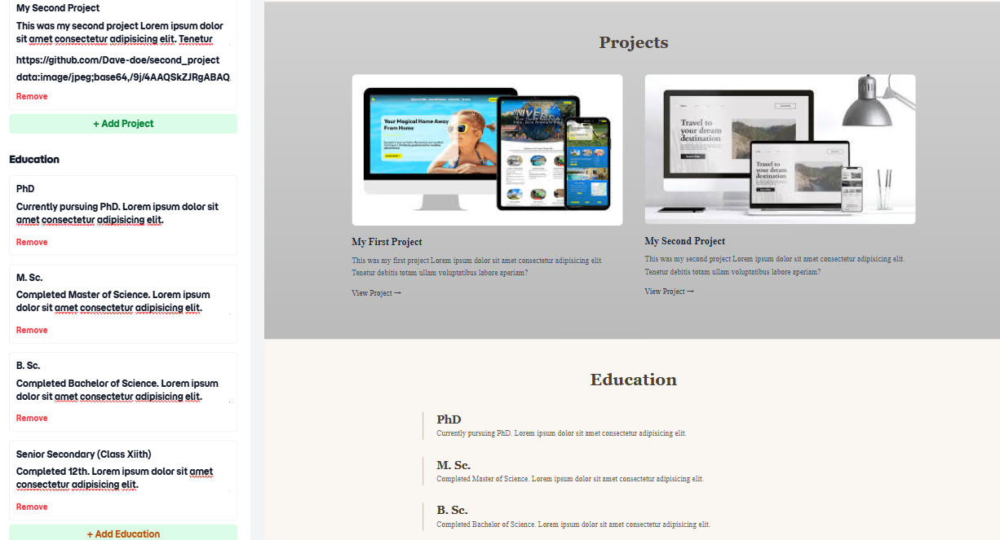

# `Craftolio — A Portfolio Builder`

_A fast, beginner-friendly tool to create, customize, and download your personal portfolio, without writing a single line of code._

---

## Overview

Craftolio is a fully client-side portfolio generator that helps users build clean, responsive, and professional portfolios instantly.  
Just enter your details, choose a template, preview it live, and download the complete HTML or ZIP file.  
No backend, no account, no data stored — everything happens in your browser.

---

## Features

- **No Code Needed:** Build a full portfolio without touching HTML/CSS.
- **Real-Time Preview:** Update details, skills, images, and projects live.
- **Multiple Templates:** Choose from professional portfolio templates.
- **Instant Export:** Download the entire portfolio as HTML or a ZIP package.
- **Fully Responsive:** Templates automatically adapt to all screen sizes.
- **100% Client-Side:** Your data stays on your device, _fully private_.
- **Clean UI/UX:** Smooth design with TailwindCSS, and modern components.

---

## Screenshots

---

## Tech Stack

- HTML
- JavaScript
- TailwindCSS
- Font Awesome
- JSZip

---

## How It Works

1. Enter your personal and professional details
2. Add skills, projects, and education
3. Choose your preferred template
4. Preview your portfolio live
5. Export HTML or download ZIP
6. Share or publish your portfolio anywhere, completely free

---

## Privacy

Craftolio is **fully client-side**.  
Your data is never uploaded, stored, or shared. Everything remains on your device.

---

## Project Structure

**Craftolio/**
\
├─ index.html  
├─ builder.html  
├─ builder.js  
├─ preview.html  
├─ about.html
\
├─ style.css  
├─ images/..
\
├── about.html  
├── package.json  
├── package-lock.json  
├── .gitignore  
└── README.md

---

## Key Functionalities

- Dynamic DOM injection
- Template rendering via JavaScript
- Real-time input syncing
- Image uploading & preview
- ZIP generation
- Single-click HTML exporting
- Responsive grid management

---

## Why I Built This

Many beginners struggle to create a portfolio due to:

- Design difficulties
- HTML/CSS complexity
- Confusing file structures
- No coding experience

Craftolio solves this by providing a **simple, fast, and free solution** for everyone.

---

## Contact

**Developer:** Harshit Pant  
**GitHub:** [Harshitpant12](https://github.com/Harshitpant12)  
**LinkedIn:** [Harshit Pant](https://www.linkedin.com/in/harshit-pant-310587236/)

---
